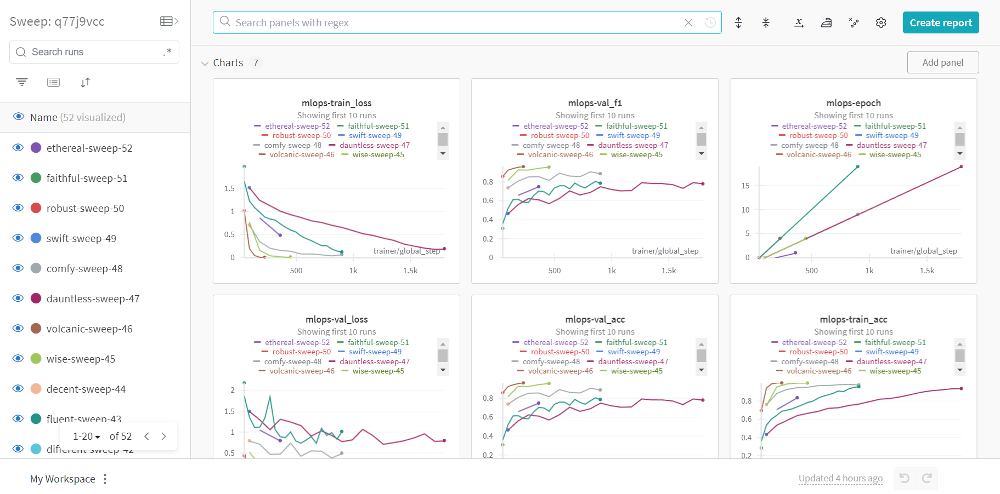
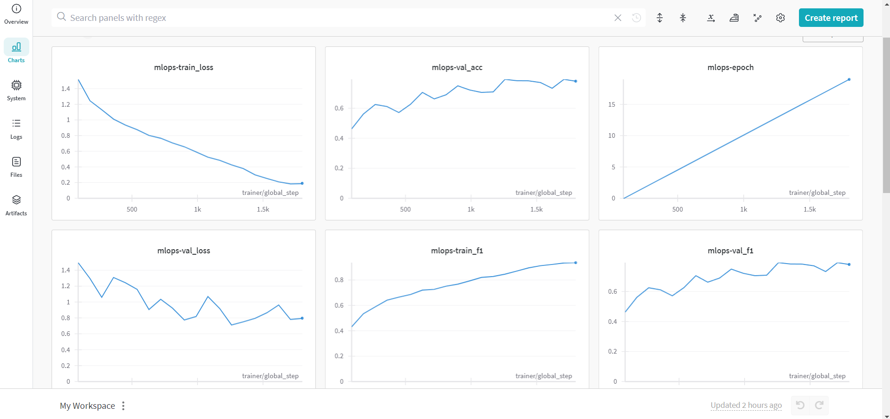
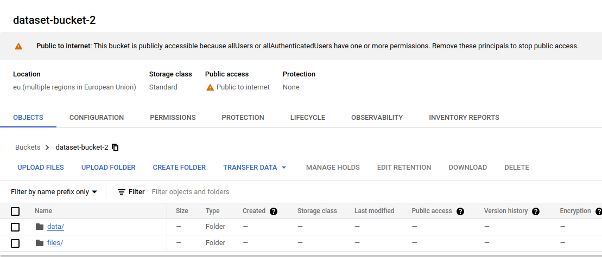
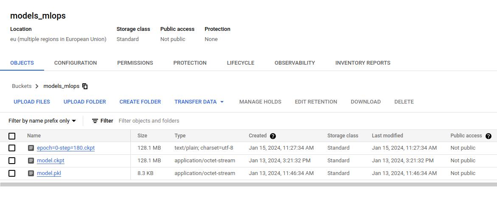
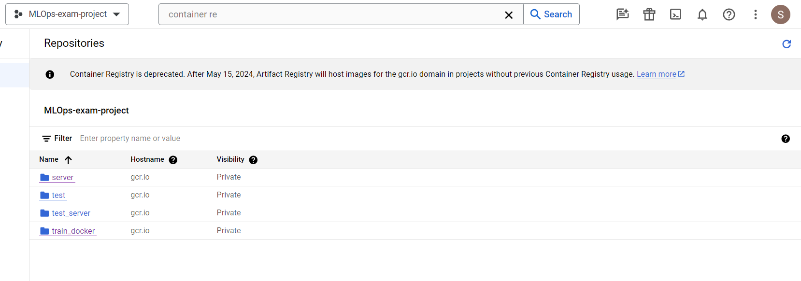
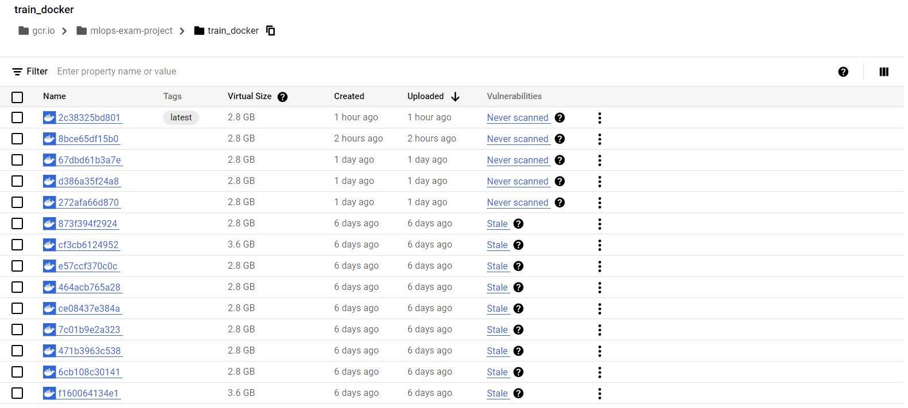
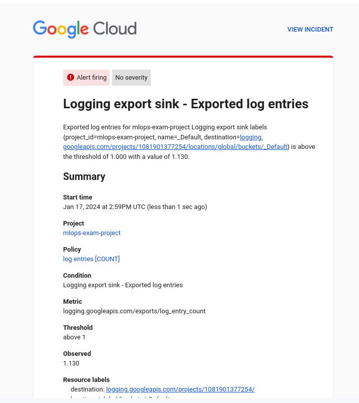
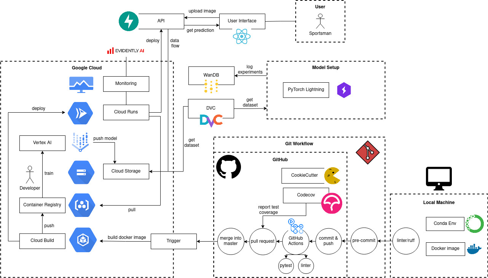

# Exam template for 02476 Machine Learning Operations

This is the report template for the exam. Please only remove the text formatted as with three dashes in front and behind
like:

```--- question 1 fill here ---```

where you instead should add your answers. Any other changes may have unwanted consequences when your report is auto
generated in the end of the course. For questions where you are asked to include images, start by adding the image to
the `figures` subfolder (please only use `.png`, `.jpg` or `.jpeg`) and then add the following code in your answer:

```markdown

```

In addition to this markdown file, we also provide the `report.py` script that provides two utility functions:

Running:

```bash
python report.py html
```

will generate an `.html` page of your report. After deadline for answering this template, we will autoscrape
everything in this `reports` folder and then use this utility to generate an `.html` page that will be your serve
as your final handin.

Running

```bash
python report.py check
```

will check your answers in this template against the constrains listed for each question e.g. is your answer too
short, too long, have you included an image when asked to.

For both functions to work it is important that you do not rename anything. The script have two dependencies that can
be installed with `pip install click markdown`.

## Overall project checklist

The checklist is *exhaustic* which means that it includes everything that you could possible do on the project in
relation the curricilum in this course. Therefore, we do not expect at all that you have checked of all boxes at the
end of the project.

### Week 1

* [x] Create a git repository
* [x] Make sure that all team members have write access to the github repository
* [x] Create a dedicated environment for you project to keep track of your packages
* [x] Create the initial file structure using cookiecutter
* [ ] Fill out the `make_dataset.py` file such that it downloads whatever data you need and
* [x] Add a model file and a training script and get that running
* [x] Remember to fill out the `requirements.txt` file with whatever dependencies that you are using
* [x] Remember to comply with good coding practices (`pep8`) while doing the project
* [ ] Do a bit of code typing and remember to document essential parts of your code
* [x] Setup version control for your data or part of your data
* [x] Construct one or multiple docker files for your code
* [x] Build the docker files locally and make sure they work as intended
* [x] Write one or multiple configurations files for your experiments
* [ ] Used Hydra to load the configurations and manage your hyperparameters
* [ ] When you have something that works somewhat, remember at some point to to some profiling and see if
      you can optimize your code
* [x] Use Weights & Biases to log training progress and other important metrics/artifacts in your code. Additionally,
      consider running a hyperparameter optimization sweep.
* [x] Use Pytorch-lightning (if applicable) to reduce the amount of boilerplate in your code

### Week 2

* [x] Write unit tests related to the data part of your code
* [x] Write unit tests related to model construction and or model training
* [x] Calculate the coverage.
* [x] Get some continuous integration running on the github repository
* [x] Create a data storage in GCP Bucket for you data and preferable link this with your data version control setup
* [x] Create a trigger workflow for automatically building your docker images
* [x] Get your model training in GCP using either the Engine or Vertex AI
* [x] Create a FastAPI application that can do inference using your model
* [ ] If applicable, consider deploying the model locally using torchserve
* [x] Deploy your model in GCP using either Functions or Run as the backend

### Week 3


* [x] Check how robust your model is towards data drifting
* [x] Setup monitoring for the system telemetry of your deployed model
* [x] Setup monitoring for the performance of your deployed model
* [x] If applicable, play around with distributed data loading
* [ ] If applicable, play around with distributed model training
* [x] Play around with quantization, compilation and pruning for you trained models to increase inference speed

### Additional

* [x] Revisit your initial project description. Did the project turn out as you wanted?
* [x] Make sure all group members have a understanding about all parts of the project
* [x] Uploaded all your code to github

## Group information

### Question 1
> **Enter the group number you signed up on <learn.inside.dtu.dk>**
>
> Answer:

--- Group 21 ---

### Question 2
> **Enter the study number for each member in the group**
>
> Example:
>
> *sXXXXXX, sXXXXXX, sXXXXXX*
>
> Answer:

--- s220274, s222953, s232952, s223177 ---

### Question 3
> **What framework did you choose to work with and did it help you complete the project?**
>
> Answer length: 100-200 words.
>
> Example:
> *We used the third-party framework ... in our project. We used functionality ... and functionality ... from the*
> *package to do ... and ... in our project*.
>
> Answer:

--- We used the third-party framework timm - PyTorch Image Models (https://huggingface.co/timm) from Hugging Face in our project, capitalizing on its functionality that offers a collection of pre-trained models for image classification. We utilized timm to easily create our model architecture by invoking the timm.create_model function, allowing us to experiment with various pre-trained models and adapt them. This not only saved us time but also enhanced the readability of the codebase. In handling optimization and logging, we decided to use the python machine learning library torch. We decided to use torch not only because of the large amount of built-in functionalities (such as dynamic quantization) but also because of the usage of cuda for performance improvements.
Additionally, we integrated the PyTorch Lightning CLI to minimize boilerplate code, structure the codebase, and automate training and testing processes. ---

## Coding environment

> In the following section we are interested in learning more about you local development environment.

### Question 4

> **Explain how you managed dependencies in your project? Explain the process a new team member would have to go**
> **through to get an exact copy of your environment.**
>
> Answer length: 100-200 words
>
> Example:
> *We used ... for managing our dependencies. The list of dependencies was auto-generated using ... . To get a*
> *complete copy of our development environment, one would have to run the following commands*
>
> Answer:

--- We used conda to set up our local environments. To create the environment the following command has to be executed `conda create -n mlops python=3.10`. Then the environment is activated with `conda activate mlops` and the requirements are installed from the provided requirements file with `pip install -r requirements.txt` or `pip install -r requirements_dev.txt` which also includes the required libraries needed for developing the project. All these steps are documented in the README file of the project. The list of dependencies was auto-generated using pipreqs. One important step in our workflow was that the requirement file had to be updated every time the codebase changed to ensure a working installation process at all times. Furthermore, we also added different requirement files to build the docker images to be able to create application specific environments. ---

### Question 5

> **We expect that you initialized your project using the cookiecutter template. Explain the overall structure of your**
> **code. Did you fill out every folder or only a subset?**
>
> Answer length: 100-200 words
>
> Example:
> *From the cookiecutter template we have filled out the ... , ... and ... folder. We have removed the ... folder*
> *because we did not use any ... in our project. We have added an ... folder that contains ... for running our*
> *experiments.*
> Answer:

--- We used the cookiecutter template that was already tailored to MLOps projects (https://github.com/SkafteNicki/cookiecutter-data-science). In general, the template helps to set up projects in a consistent structure while saving time. We removed the notebooks folder since we did not write any jupyter notebooks for this project. We have added a config folder to store the different config.yaml files. Furthermore, a .dvc folder was added because we are using dvc as a data versioning tool. Also, the structure of the {{ cookiecutter.project_name }} looks different. Since we decided to use PyTorch Lightning CLI we did not write a ´predict_model.py´ and ´train_model.py´ file. Instead we wrote a ´main.py´ file that can be invoked with config files and arguments to train or predict.
TODO: add description why only use raw data but not processed data; explain why we do not have any docs
 ---

### Question 6

> **Did you implement any rules for code quality and format? Additionally, explain with your own words why these**
> **concepts matters in larger projects.**
>
> Answer length: 50-100 words.
>
> Answer:

--- We implemented styling guidelines and incorporated Ruff as a linter in our project. Enforcing code formatting, we integrated a pre-commit check to ensure correct code styling. Moreover, we restricted merges into the master branch unless the code had ruff formatting standards through GitHub Actions. To uphold code quality, developers were required to work on individual branches and could only merge into master after a code review and approval of their pull request. Establishing rules for code quality and format in large projects is crucial for readability, maintainability, scalability and minimizing common coding errors. ---

## Version control

> In the following section we are interested in how version control was used in your project during development to
> corporate and increase the quality of your code.

### Question 7

> **How many tests did you implement and what are they testing in your code?**
>
> Answer length: 50-100 words.
>
> Example:
> *In total we have implemented X tests. Primarily we are testing ... and ... as these the most critical parts of our*
> *application but also ... .*
>
> Answer:

--- The total number of implemented tests is 14. These tests are directed to our model, our dataset and our data loader. They test things like forward pass, the training or the validation for the model, the size and the existence of labels on the dataset, and the correct loading of data from our data loader. The aim of the tests is to have certainty that every update of the code that concerns these 3 fields is compatible, allowing us to have a continuous integration workflow.  ---

### Question 8

> **What is the total code coverage (in percentage) of your code? If you code had an code coverage of 100% (or close**
> **to), would you still trust it to be error free? Explain you reasoning.**
>
> Answer length: 100-200 words.
>
> Example:
> *The total code coverage of code is X%, which includes all our source code. We are far from 100% coverage of our **
> *code and even if we were then...*
>
> Answer:

--- The total code coverage is 42.26%. It does not include all of our source code. We are not testing the FastAPI application and the main function that invokes the LightningCLI. We believe that for the LightningCLI it is hard to write a unit test, and testing of this file would only be manageable with integration testing. But we are far from 100% code coverage of our codebase because the whole application code is not tested. That is due to the fact that we would have needed to mock the Cloud functionality for the tests. Since pytest is a completely new framework for us we decided to concentrate on other parts of the project rather than getting the tests to work.
But even if we had 100% code coverage, we would still not trust our code to be error free. That is because unittests only test individual units of the code but not the integration. Therefore, it is necessary to also add integration and user tests. Furthermore, if the developer who wrote the code is also writing the tests, it can easily happen that he misses edge cases or exactly tests what the code is doing and not what the function is supposed to do. Last but not least a test coverage of 100% does not necessarily mean that all functionalities in the code are tested. There are a lot of aspects like scalability, concurrency or third-library integration that might not be tested.  ---

### Question 9

> **Did you workflow include using branches and pull requests? If yes, explain how. If not, explain how branches and**
> **pull request can help improve version control.**
>
> Answer length: 100-200 words.
>
> Example:
> *We made use of both branches and PRs in our project. In our group, each member had an branch that they worked on in*
> *addition to the main branch. To merge code we ...*
>
> Answer:

--- We made use of different features provided by git. First, we created a project for our GitHub repo with a minimalistic Kanban board. We added the weekly Todos as tickets to the board and tracked the progress in “Todo”, “Progress” and “Done”. During the project days we had meetings to discuss who wants to work on which ticket and we assigned this developer to the ticket. Then, the workflow was to first create a branch for this fix or feature. The branch was either based on the current version of the master branch or a different branch which features were needed for development. During development we committed and pushed the changes constantly to GitHub. When the code was implemented and the pipeline succeeded a Pull Request had to be opened and at least one reviewer needed to approve the changes. If the HEAD changed the developer had to rebase and then the code could be merged onto the master branch with a descriptive commit message. We agreed on using “Squash commit” to make rollbacks easier. When the branch was merged the feature branch automatically got deleted and the developer was able to drag the ticket to “Done” during the next meeting. To ensure this workflow the master branch was protected and the pipeline had to succeed as well as the PR needed to be approved before merging was possible.  ---

### Question 10

> **Did you use DVC for managing data in your project? If yes, then how did it improve your project to have version**
> **control of your data. If no, explain a case where it would be beneficial to have version control of your data.**
>
> Answer length: 100-200 words.
>
> Example:
> *We did make use of DVC in the following way: ... . In the end it helped us in ... for controlling ... part of our*
> *pipeline*
>
> Answer:

--- We have used DVC as our version control software for data. In the beginning we stored the data at google drive, achieving a version control for our data and the opportunity to get the dataset out of our Github repo and pull it from DVC when needed. It also gave the opportunity to expand or reduce the dataset due to the easy switch that the version control offers.


Later, when we started working with google cloud, we changed the storage place to a GC Bucket. This solution allowed us to not just pull the data locally when we needed to, but also to have easier access to it when training on the cloud. ---

### Question 11

> **Discuss you continues integration setup. What kind of CI are you running (unittesting, linting, etc.)? Do you test**
> **multiple operating systems, python version etc. Do you make use of caching? Feel free to insert a link to one of**
> **your github actions workflow.**
>
> Answer length: 200-300 words.
>
> Example:
> *We have organized our CI into 3 separate files: one for doing ..., one for running ... testing and one for running*
> *... . In particular for our ..., we used ... .An example of a triggered workflow can be seen here: <weblink>*
>
> Answer:

--- The continuous integration has been organized in two differentiated parts, the linting and the testing. The first of them, the linting makes sure that the code is written on an organized and standardized way. This is done mainly with the tool Ruff.
The second of the parts is the testing part. In this part the github action runs all the tests that have been designed to check if the changes done to the code integrate well with the rest of the structure. It also generates a report, including the coverage of the tests into the different files. Apart from testing the code itself, it pulls the data from DVC, serving also to check that it works correctly.

In the testing file, we run our tests on the latest version of ubuntu and on python 3.10. As this workflow is already really time consuming, we have decided to keep it as agile as possible when working together, not adding more OS or python versions, ensuring that we all are working in a similar conda environment. In order to run the file install all the dependencies on the requirements and authenticates on google cloud using a secret from our repository. After this process it is when the actual testing begins. Link to one of our workflows: https://github.com/hmhauter/mlops_exam_project/actions/runs/7570299939/job/20615373159 ---

## Running code and tracking experiments

> In the following section we are interested in learning more about the experimental setup for running your code and
> especially the reproducibility of your experiments.

### Question 12

> **How did you configure experiments? Did you make use of config files? Explain with coding examples of how you would**
> **run a experiment.**
>
> Answer length: 50-100 words.
>
> Example:
> *We used a simple argparser, that worked in the following way: python my_script.py --lr 1e-3 --batch_size 25*
>
> Answer:

--- We have used a config file that contains the different parameters needed to load our data, build our model, run the training and other things like connect the model with Wandb. This is one with a config file called main.yaml. With the use of a file we have gotten rid of the need of specify any hyperparameter on the command line when running the script. Instead the way to run our project is: python -u .\src\main.py -c .\config\main.yaml fit. For the rest of experiments, we just kept adding config files changing the parameters we were interested in.
 ---

### Question 13

> **Reproducibility of experiments are important. Related to the last question, how did you secure that no information**
> **is lost when running experiments and that your experiments are reproducible?**
>
> Answer length: 100-200 words.
>
> Example:
> *We made use of config files. Whenever an experiment is run the following happens: ... . To reproduce an experiment*
> *one would have to do ...*
>
> Answer:

--- We made use of config files, as it was explained in the last question. Also, we use Wandb to control the reproducibility. Whenever an experiment is run we store not only the metrics from the different experiments but also the model itself and the config file used on the experiment. In order to reproduce an experiment, it would be enough with running the model with the same config file as the experiment you want to reproduce has. Some parameters were chosen by us, and some other parameters were randomly chosen by wandb, mainly being the seed used for each experiment (crucial for a correct reproducibility) ---


### Question 14

> **Upload 1 to 3 screenshots that show the experiments that you have done in W&B (or another experiment tracking**
> **service of your choice). This may include loss graphs, logged images, hyperparameter sweeps etc. You can take**
> **inspiration from [this figure](figures/wandb.png). Explain what metrics you are tracking and why they are**
> **important.**
>
> Answer length: 200-300 words + 1 to 3 screenshots.
>
> Example:
> *As seen in the first image when have tracked ... and ... which both inform us about ... in our experiments.*
> *As seen in the second image we are also tracking ... and ...*
>
> Answer:

--- The images we have chosen to include are all from our hyperparameter sweep. This will allow us to go over more features and have a more complete explanation. In our case we have used Wandb to do this sweep. In the first image it can be seen an overview of the sweep. We have run 52 runs with different parameters, storing on each of them the important training values, as the accuracies, losses, or the f1 score, as also the different parameters of each run, as epochs, batch size or learning rate. Another of the values that wandb allow us to register are related to the system, like memory or cpu usage.
.


In the second figure, it can be seen a graph that compares the loss (which was the value the sweep was aiming to minimize) between the different runs indicating also what were the parameters on each


.


Lastly on the third figure, it can be seen one specific run. The sweep saves each of the runs as individual ones, saving not only the training values but also important files for the reproducibility of each run, like config files, requirements files or the logs of the run.


.


 ---

### Question 15

> **Docker is an important tool for creating containerized applications. Explain how you used docker in your**
> **experiments? Include how you would run your docker images and include a link to one of your docker files.**
>
> Answer length: 100-200 words.
>
> Example:
> *For our project we developed several images: one for training, inference and deployment. For example to run the*
> *training docker image: `docker run trainer:latest lr=1e-3 batch_size=64`. Link to docker file: <weblink>*
>
> Answer:

--- Dockerfile has been crucial with our project, since it has been a fast way of creating fast a new environment with all the dependencies up to date. We have created mainly two dockerfiles, one for development and one for testing. These two dockerfiles had almost the same content since many of the dependencies were needed in both cases.
In the other hand, we also made good use of the google cloud triggers, were each time the main branch of our github repository was updated, we would instantiate a new docker image with the new changes. This was a good way of having fast access to up to date images whenever it was needed.
We used a cloudbuild.yaml file which the trigger would use to instantiate our docker file called train_model.dockerfile, which can be found in the ‘dockerfiles/’ folder. ---

### Question 16

> **When running into bugs while trying to run your experiments, how did you perform debugging? Additionally, did you**
> **try to profile your code or do you think it is already perfect?**
>
> Answer length: 100-200 words.
>
> Example:
> *Debugging method was dependent on group member. Some just used ... and others used ... . We did a single profiling*
> *run of our main code at some point that showed ...*
>
> Answer:

--- For debugging all the group members have used the integrated debugger that can be found in visual studio code. With the nature of our workflow, when working individually or doing pair programming we used the different set of tools that the debugger offers, such as execution by steps or break points to identify, analyze and fix various types of bugs that appeared during the development of the project. Previous experience with similar debuggers such as the one from IDE turned out to be useful in our case too.


When it comes to problem solving, we also made use of standup meetings in order to address known issues and got together in order to focus and address them.  ---

## Working in the cloud

> In the following section we would like to know more about your experience when developing in the cloud.

### Question 17

> **List all the GCP services that you made use of in your project and shortly explain what each service does?**
>
> Answer length: 50-200 words.
>
> Example:
> *We used the following two services: Engine and Bucket. Engine is used for... and Bucket is used for...*
>
> Answer:

--- Buckets: For data storing, such as saving the project’s dataset
Triggers: To automate the creation of an updated docker image
Monitor: For monitoring the health of our application
Vertex AI: It has been used for training our convolutional neural network
Cloud run: For deploying the server with the model so it can be accessed online through a web front-end.
---

### Question 18

> **The backbone of GCP is the Compute engine. Explained how you made use of this service and what type of VMs**
> **you used?**
>
> Answer length: 100-200 words.
>
> Example:
> *We used the compute engine to run our ... . We used instances with the following hardware: ... and we started the*
> *using a custom container: ...*
>
> Answer:

---
We use [TODO]
---

### Question 19

> **Insert 1-2 images of your GCP bucket, such that we can see what data you have stored in it.**
> **You can take inspiration from [this figure](figures/bucket.png).**
>
> Answer:

--- 
 ---

### Question 20

> **Upload one image of your GCP container registry, such that we can see the different images that you have stored.**
> **You can take inspiration from [this figure](figures/registry.png).**
>
> Answer:

---  ---

### Question 21

> **Upload one image of your GCP cloud build history, so we can see the history of the images that have been build in**
> **your project. You can take inspiration from [this figure](figures/build.png).**
>
> Answer:

---  ---

### Question 22

> **Did you manage to deploy your model, either in locally or cloud? If not, describe why. If yes, describe how and**
> **preferably how you invoke your deployed service?**
>
> Answer length: 100-200 words.
>
> Example:
> *For deployment we wrapped our model into application using ... . We first tried locally serving the model, which*
> *worked. Afterwards we deployed it in the cloud, using ... . To invoke the service an user would call*
> *`curl -X POST -F "file=@file.json"<weburl>`*
>
> Answer:

--- question 22 fill here ---

### Question 23

> **Did you manage to implement monitoring of your deployed model? If yes, explain how it works. If not, explain how**
> **monitoring would help the longevity of your application.**
>
> Answer length: 100-200 words.
>
> Example:
> *We did not manage to implement monitoring. We would like to have monitoring implemented such that over time we could*
> *measure ... and ... that would inform us about this ... behaviour of our application.*
>
> Answer:

--- For the deployed model we managed to use monitoring by using the alarms system already incorporated in google cloud. For this, we created an alarm to monitor the counter of log entries.
This alarm was configured so every time there was some log movement, it would send an email to an account notifying that the log movement surpassed the manually imputed threshold.
During this, we also realised the importance of choosing a threshold wisely since we were receiving a great amount of alarms in our email inbox. In the following image we can see one of the emails sent by the alarm explained before:
 ---

### Question 24

> **How many credits did you end up using during the project and what service was most expensive?**
>
> Answer length: 25-100 words.
>
> Example:
> *Group member 1 used ..., Group member 2 used ..., in total ... credits was spend during development. The service*
> *costing the most was ... due to ...*
>
> Answer:

--- In the end, since we all joined Sergio’s project, we mainly spent the money from the same google cloud account for the project development. We ended up spending a bit under 20$, which is lower than we all expected. On the other hand, Jeremi spent the whole 50$ trying to have runs using the computer engine GPU’s. Helena’s account was left with around 40$. ---

## Overall discussion of project

> In the following section we would like you to think about the general structure of your project.

### Question 25

> **Include a figure that describes the overall architecture of your system and what services that you make use of.**
> **You can take inspiration from [this figure](figures/overview.png). Additionally in your own words, explain the**
> **overall steps in figure.**
>
> Answer length: 200-400 words
>
> Example:
>
> *The starting point of the diagram is our local setup, where we integrated ... and ... and ... into our code.*
> *Whenever we commit code and puch to github, it auto triggers ... and ... . From there the diagram shows ...*
>
> Answer:

--- 
The starting point of the diagram is our local setup where every developer had to set up his conda environment. This is done with the requirement files provided in the code. Additionally, we integrated docker files into our code such that the code can be built at anytime independent of the local setup. In the local setup also the linter has to be run to format the code.
The model setup was done with PyTorchLightning. Additionally, WanDB is used to log experiments and DVC does the version control for our data.
Whenever we want to commit changes, first pre-commit is run. When all hooks are passed we can commit and push to GitHub. Then the continuous integration pipeline runs executing the GitHub actions pytest and linter. Additionally, we can create a pull request to merge the branch into the master. For the pull request, a code coverage report for the tests is created. When the branch is merged into the master a trigger is activated executing configuration files that orchestrate the deployment of the model. On Cloud Build the docker image for the server and monitoring as well as the docker image for training the model is built. Next, these images are pushed to the container registry. As a final step, the container image for the server and monitoring is deployed to Cloud Run. Next, a developer can submit a job to start the training with Vertex AI using the latest docker image for training that was pushed to the container registry. After training, the model is stored in the model bucket in the Cloud Storage. Logs as well as the model are pushed to WanDB for versioning. Cloud Run is monitored by Cloud monitoring and an alert system was added. The application using fastAPI is fetching and pushing data to Cloud Storage. The user interacts with the API through a User Interface allowing him to upload images. Whenever the API calls predict image features are written to a bucket in Cloud Storage to have the possibility to monitor data drift with evidently. ---

### Question 26

> **Discuss the overall struggles of the project. Where did you spend most time and what did you do to overcome these**
> **challenges?**
>
> Answer length: 200-400 words.
>
> Example:
> *The biggest challenges in the project was using ... tool to do ... . The reason for this was ...*
>
> Answer:

--- Because of the tests for the continuous integration, we tried to cache our dataset so it would not get pulled with dvc everytime we merged branches. We did not successfully solve this issue, which increased the time needed for managing pull requests. Additionally, we spent a lot of the free GitHub minutes on that problem.
One of the big struggles we also found during the development of the project was the difficulty of applying quantization. Because of the nature of our project, since we were using the timm library to create a pretrained ResNet18, it was difficult for us to apply these optimization methods. After trying to use dynamic quantization unsuccessfully, we tried to apply it manually but we did not succeed.
Another overall struggel was the high load of information and new tools we learned throughout the course. It was hard to keep track and not to lose the overview. Splitting tasks and doing knowledge sharing during the meetings where everyone explained what he was working on helped a lot to overcome that problem.
---

### Question 27

> **State the individual contributions of each team member. This is required information from DTU, because we need to**
> **make sure all members contributed actively to the project**
>
> Answer length: 50-200 words.
>
> Example:
> *Student sXXXXXX was in charge of developing of setting up the initial cookie cutter project and developing of the*
> *docker containers for training our applications.*
> *Student sXXXXXX was in charge of training our models in the cloud and deploying them afterwards.*
> *All members contributed to code by...*
>
> Answer:

--- Student s222953 was in charge of the docker images, docker testing, configuring the trigger for docker instantiation. Also worked on the wandb sweep, quantization and setup the monitoring for the deployed model.
Student s223177 has been in charge of the version control on google drive and google cloud later. Also has worked on the Cloud training with VertexAI, bucket management, wandb sweep and play around with advanced functions like quantization or compilation.
Student s220274 was responsible for setting up the git repository, code coverage and GitHub Actions. Also did the deployment part of the fastAPI application to work with Docker and the Cloud plus evidently.
Student s232952 was responsible for implementing and testing datamodule and support for pytorch lightining CLI, Also he was in charge of creating base of fastAPI aplication for model infrences and set up the telemetry mesurments of deployed model.---
